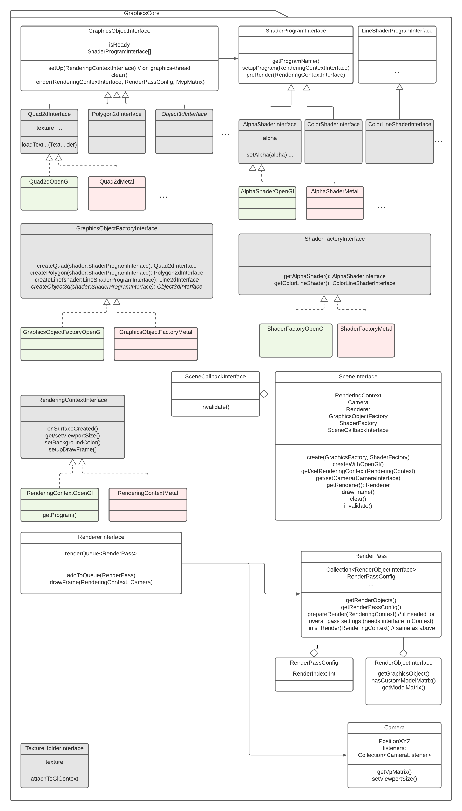
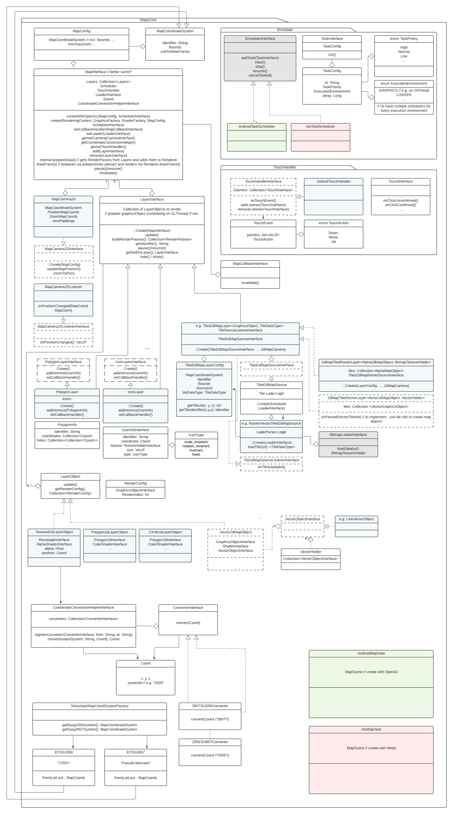

<h1 align="center">Open Mobile Maps</h1>
 

  
   
   
  The lightweight and modern Map SDK for Android (6.0+) and iOS (10+)
   
   
  <a href="https://openmobilemaps.io/">openmobilemaps.io</a>

 

    <!-- SPM -->
    
    <!-- License -->
    
    <!-- iOS Build -->
    
    <!-- android Build -->
    

## Getting started

[Readme Android](./android/)

[Readme iOS](./ios/)

## Features
* Multi-platform graphics engine based on OpenGL for Android and Metal for iOS
* Touch and gesture handling
* Tiled Map Layers
* Polygon Layers

...and more to come! See our roadmap at [openmobilemaps.io](https://openmobilemaps.io)

## Architecture

To support both the Android and iOS, most of the code-base is written in C++ and shared between the two platforms. The Kotlin and swift interface bindings are generated with a fork of the [Djinni library](https://github.com/UbiqueInnovation/djinni). The Maps library intentionally is designed to have a modular structure, so that most parts of it can be adjusted or completely replaced with custom implementations. Most of the interfaces are also exposed to Swift and Kotlin, so extensions can also conveniently be programmed in those languages.

The internal structure of the project is split into two main modules: the graphics-core and the maps-core. While the first implements a generic structure for rendering basic graphic primitives on Android and iOS, the latter is a collection of classes that provide the basics for creating a digital map.

### Graphics Core

The rendering concept in the graphics core is built around generic graphics primitives to achieve a versatile base structure. While the basic logic for organizing the primitives is shared, the implementations of those graphics object interfaces are platform-specific. For Android, the OpenGl code is kept in C++, while the Metal-implementations for iOS are written in Swift. The SceneInterface is the shared, central collection of the necessary interfaces for both creating and rendering such graphics objects. 

### Maps Core

Building on top of the graphics core, the maps core wraps the generic render code into a more accessible collection of higher-level classes with the functionality to build and display a digital map.  

#### MapView

On both platforms, the MapView builds the central ui element that can directly be added to the app and be interacted with. It handles the interactions between each platform and the shared library, the lifecycle of the view, as well as setting up relevant platform-specific components and exposing the necessary methods for manipulating all elements of the map.

#### MapScene

The MapScene, implementing the MapInterface, holds the necessary resources for interacting with the underlying render system and creating the graphics primitives, but also builds the main access point for the other components that are relevant for a functioning map. Such as the map configuration file, the camera, the touch handler and other. It also holds the collection of all layers in the scene and provides the necessary methods to adjust it.

#### Map Configuration & Coordinates

When setting up the Map, a coordinate system for the map needs to be specified. In the current implementation, the system is assumed to be a uniform, two-dimensional grid. 

All map positions handled within maps core are of the type Coord. Along with the three-dimensional position values, it holds a coordinate system identifier with the purpose of specifically exposing the system that the values should be interpreted in at that time. To switch between different coordinate systems, the MapScene holds a CoordinateConversionHelper. This helper uses pre-defined and additionally registered custom converters to transform coordinates between two systems, specified by their system identifier.

This library comes with the implementations for two prominent coordinate systems: EPSG:2056 (LV95/LV03+) and EPSG:3857 (Pseudo-Mercator). They can be created using the CoordinateSystemFactory.

#### Camera & Interaction

The camera attached to the MapScene defines the section of the map that is rendered when a frame is drawn. It also handles and interprets interaction events passed to it by a TouchHandler. Maps core contains an implementation for a simple orthographic camera moving in the x/y-plane and a DefaultTouchHandler for a matching gesture recognition. The camera component offers an interface for querying and setting its current position in the space defined by the maps coordinate system.

#### Layers

The graphical content displayed in the map scene is grouped in layers. A layer contains one to many LayerObject. These are collections of the information necessary to place a graphics primitive in the maps coordinate space and that define their appearance. Before a new frame is drawn, the MapScene queries all added layers for a configuration, specifying which graphics need to be drawn in which respective order.

Two layer types are available with MapsCore: the Tiled2dMapRasterLayer and the PolygonLayer.

##### Tiled Raster Layer

The content of most digital maps is split into hierarchical layers of map tiles. This layer supports both the loading and displaying of the relevant tiles for a given camera position and zoom-value. On creation of such a layer, a Tiled2dMapLayerConfig needs to be defined. It specifies the layers coordinate system by setting the bounds coordinates, as well as the different zoom layers and provides the url/identifier for loading the tiles.

In Addition to the configuration, an implementation of the TextureLoaderInterface needs to be supplied. A default implementation to load tiles from a given URL is contained in maps core on both platforms.

##### Polygon Layer

The PolygonLayer provides an interface to create and draw uniformly colored polygons in the map space.   

## License
This project is licensed under the terms of the MPL 2 license. See the [LICENSE](LICENSE) file.
